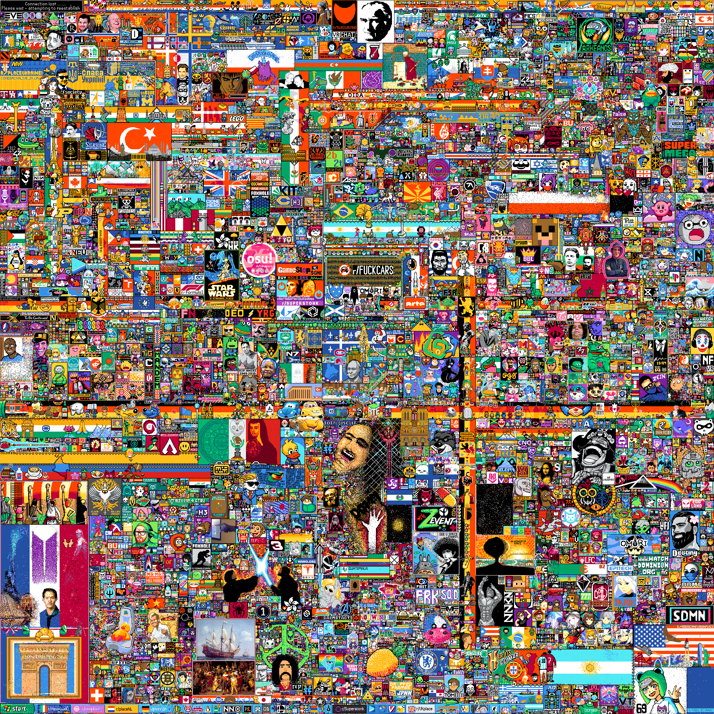

> This Repository is a identical copy from the reddit r/place 2022 dataset.  
> It serves for archiving!

# r/place Datasets (April Fools 2022)
> Posted by [u/paul_that](https://www.reddit.com/user/paul_that/)
> Post Url: https://www.reddit.com/r/place/comments/txvk2d/rplace_datasets_april_fools_2022/

r/place has proven that Redditors are at their best when they collaborate to build something creative. In that spirit, we are excited to share with you the data from this global, shared experience.

## Media
The final moment before only allowing white tiles: https://placedata.reddit.com/data/final_place.png

available in higher resolution at:

https://placedata.reddit.com/data/final_place_2x.png
https://placedata.reddit.com/data/final_place_3x.png
https://placedata.reddit.com/data/final_place_4x.png
https://placedata.reddit.com/data/final_place_8x.png



A clean, full resolution timelapse video of the multi-day experience: https://placedata.reddit.com/data/place_2022_official_timelapse.mp4

## Tile Placement Data
The good stuff; all tile placement data for the entire duration of r/place.

The data is available as a CSV file with the following format:

``timestamp``, ``user_id``, ``pixel_color``, ``coordinate``

- Timestamp - the UTC time of the tile placement

- User_id - a hashed identifier for each user placing the tile. These are not reddit user_ids, but instead a hashed identifier to allow correlating tiles placed by the same user.

- Pixel_color - the hex color code of the tile placedCoordinate - the “x,y” coordinate of the tile placement. 0,0 is the top left corner. 1999,0 is the top right corner. 0,1999 is the bottom left corner of the fully expanded canvas. 1999,1999 is the bottom right corner of the fully expanded canvas.

example row:
```
2022-04-03 17:38:22.252 UTC,yTrYCd4LUpBn4rIyNXkkW2+Fac5cQHK2lsDpNghkq0oPu9o//8oPZPlLM4CXQeEIId7l011MbHcAaLyqfhSRoA==,#FF3881,"0,0"
```

Shows the first recorded placement on the position 0,0.

Inside the dataset there are instances of moderators using a rectangle drawing tool to handle inappropriate content. These rows differ in the coordinate tuple which contain four values instead of two–“x1,y1,x2,y2” corresponding to the upper left x1, y1 coordinate and the lower right x2, y2 coordinate of the moderation rect. These events apply the specified color to all tiles within those two points, inclusive.

This data is available in 79 separate files at https://placedata.reddit.com/data/canvas-history/2022_place_canvas_history-000000000000.csv.gzip through https://placedata.reddit.com/data/canvas-history/2022_place_canvas_history-000000000078.csv.gzip

You can find these listed out at the index page at https://placedata.reddit.com/data/canvas-history/index.html

This data is also available in one large file at https://placedata.reddit.com/data/canvas-history/2022_place_canvas_history.csv.gzip

For the archivists in the crowd, you can also find the data from our last r/place experience 5 years ago here: https://www.reddit.com/r/redditdata/comments/6640ru/place_datasets_april_fools_2017/

## Conclusion
We hope you will build meaningful and beautiful experiences with this data. We are all excited to see what you will create.

If you wish you could work with interesting data like this everyday, we are always hiring for more talented and passionate people. See our careers page for open roles if you are curious https://www.redditinc.com/careers


Edit: We have identified and corrected an issue with incorrect coordinates in our CSV rows corresponding to the rectangle drawing tool. We have also heard your asks for a higher resolution version of the provided image; you can now find 2x, 3x, 4x, and 8x versions.

## Further note
I removed the gzip compression and compressed each file again with LZMA in a zip file. This has a disk space advantage. Some zip files were compressed more to respect the Github file size limit.